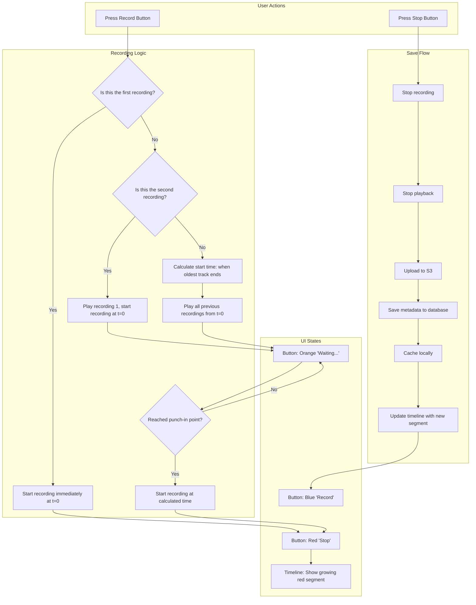
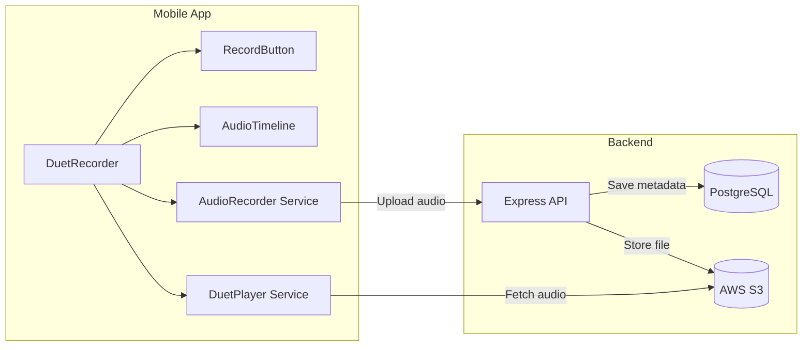

# Tap Story

Monorepo with React Native mobile app and Express.js backend API for collaborative audio storytelling.

---

## Documentation

**See [docs/](docs/) for complete project documentation.**

Quick links:
- **[System Architecture](docs/architecture.md)** - Start here if you're new to the project
- **[Backend](docs/backend.md)** - API structure and database
- **[Mobile App](docs/mobile.md)** - React Native app
- **[Infrastructure](docs/infrastructure.md)** - Deployment and hosting
- **[Services](docs/services.md)** - External integrations

---

## Local Development

The development environment uses [**devenv**](https://devenv.sh/) and [**direnv**](https://direnv.net/) to manage Node.js 20, PostgreSQL, FFmpeg, and other dependencies.

### Quick Start

1. Install [Nix](https://nixos.org/download.html) (with flakes enabled) and [direnv](https://direnv.net/docs/installation.html)
2. Copy environment template:
   - `cp backend/.env.example backend/.env` (configure backend API secrets)
3. Run `direnv allow` in the project directory (first time only)
4. Run setup: `setup`
5. Start developing:
   - Backend: `npm run dev:api`
   - Mobile app: `npm run dev:mobile`

**Note:** See [docs/infrastructure.md](docs/infrastructure.md) for details on configuring environment variables.

---

## Database Connection

Postgres is managed automatically by devenv. You can connect to the database using any client:

**Connection Details:**

```
Host: localhost
Port: 5432
Database: tapstory
Username: tapstory_user
Password: tapstory_password
```

---

## Database Migrations

To make changes to the database schema, update the `backend/prisma/schema.prisma` file and then run:

```bash
npm run migrate
```

For other Prisma commands:

```bash
npm run prisma -- studio  # Open Prisma Studio
npm run db:query          # Alias for Prisma Studio
```

Install the Prisma VSCode extension for syntax highlighting and autocomplete.

---

## Before Submitting a Pull Request

Before putting up a PR, please make sure to check for TypeScript problems and run tests:

```bash
npm run check
npm run test
```

---

## Duet Recording Flow

The app's core feature is "duet recording" - a collaborative audio chain where users record over previous recordings to create layered audio stories.

### How It Works

1. **First Recording (A)**: User presses Record, records audio, presses Stop. Recording starts at timeline position 0.
2. **Second Recording (B)**: User presses Record again. Recording A plays back while user records B simultaneously. Recording B also starts at position 0, creating a duet.
3. **Third+ Recording (C, D, ...)**: Previous recordings play back. New recording starts when the *oldest* still-playing track ends, creating a cascading chain.

### Timeline Example

```
Time:    0s      5s      10s     15s     20s     25s
         |-------|-------|-------|-------|-------|
    A:   [========]                              (0-10s)
    B:   [==============]                        (0-15s, duet with A)
    C:            [==========]                   (10-20s, starts when A ends)
    D:                  [==========]             (15-25s, starts when B ends)
```

### Recording Flow Diagram



### Component Architecture



### Key Files

| File | Purpose |
|------|---------|
| `mobile/components/DuetRecorder.tsx` | Main recording orchestration component |
| `mobile/components/RecordButton.tsx` | Visual button with Record/Waiting/Stop states |
| `mobile/components/AudioTimeline.tsx` | Timeline visualization with pinch-to-zoom |
| `mobile/services/audioService.ts` | Recording and S3 upload handling |
| `mobile/services/duetPlayer.ts` | Overlapping playback of multiple audio segments |
| `backend/src/routes/audioRoutes.ts` | API endpoints for audio upload/metadata |

---

## Deployment

See **[docs/infrastructure.md](docs/infrastructure.md)** for deployment documentation.

(Not yet configured)
