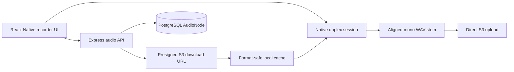

# System Architecture

## Product goal

Tap Story is a collaborative audio-storytelling app built around an immutable
chain of isolated recordings. A participant hears the existing story and adds a
new performance without destructively modifying earlier stems. A node may have
multiple children, so the same story can branch into alternate continuations.

The current interaction is an alternating two-track timeline:

1. recordings A and B begin at timeline zero;
2. recording C begins when A ends;
3. recording D begins when B ends;
4. later recordings continue the same two-lane rule.

Reliable overdub alignment is a core product requirement, not a cosmetic
enhancement. Built-in and wired routes target perceptual alignment within
5–10 ms. See [Audio synchronization](./AUDIO_SYNC_ISSUE.md) and the
[device acceptance plan](./plans/2026-07-12-reliable-audio-sync.md).

## Repository layout

Tap Story is a TypeScript npm-workspace monorepo:

- `mobile/` — React Native 0.81 / Expo 54 app plus native Android and iOS audio
  engines;
- `backend/` — Express API, Prisma/PostgreSQL persistence, S3 presigned URLs,
  and audio calibration analysis;
- `shared/` — API contracts, audio-node types, validation, and the canonical
  timeline calculator.

## Data model

Each `AudioNode` is one isolated stem in a parent/child tree:

```typescript
interface AudioNode {
  id: string;
  audioUrl: string;
  parentId: string | null;
  durationMs: number;
  startTimeMs: number;
  createdAt: string;
  updatedAt: string;
}
```

`durationMs` and `startTimeMs` are authoritative integer timeline metadata.
They are never reconstructed from rounded seconds after a node is saved. The
client sends duration and parent identity; the backend derives `startTimeMs`
from the persisted chain. The shared `getNextTimelineStartTimeMs` function
previews the same rule: the first two start at zero and every later node starts
at the end of the node two positions back.

## Audio and persistence flow



The mobile app keeps stems separate and mixes them during native playback. The
backend does not currently bounce a parent and child into one destructive mix.
Server-side derived mixes remain a possible delivery optimization, but the
isolated recordings and exact timeline metadata are the source of truth.

## Native synchronization architecture

- Android uses Oboe `FullDuplexStream` with the device-negotiated sample rate.
- iOS uses a RemoteIO AudioUnit with an aggregated play-and-record session.
- Existing assets are decoded, mixed to mono, and resampled before playback.
- Capture is armed at a logical punch point and gated using route round-trip
  compensation. The saved stem is placed at the logical point.
- The real-time callback only mixes and moves PCM through a preallocated SPSC
  ring. A background thread writes the raw capture.
- Transport stop is a callback handshake. The first callback that mutes output
  defines the end, and capture continues through the exact latency tail before
  the realtime stream is quiesced. Finalization then drains and validates the
  preserved writer state. Overflowed or discontinuous takes fail rather than
  silently losing frames.
- Bluetooth-class routes are rejected for synchronized overdubs because their
  latency is large and variable.
- Device changes, interruptions, and iOS media-service resets invalidate the
  engine and active take; reinitialization reloads tracks at the new route rate.

Expo AV remains a fallback for first-take recording and playback when the native
module is unavailable. It is not treated as a reliable overdub engine.

## Backend responsibilities

The backend provides:

- presigned S3 upload/download URLs;
- exact audio-node metadata persistence;
- ancestor-chain and leaf-chain queries;
- branch deletion from S3 and PostgreSQL;
- guided latency analysis using normalized cross-correlation.

See [Backend architecture](./backend.md).

## Verification boundary

Frame math, lifecycle, decoding, cache paths, and correlation are covered by
automated tests. Acoustic round-trip behavior cannot be proven on a simulator.
Physical-device loopback acceptance is still required before a release is
described as meeting the 5–10 ms target.
